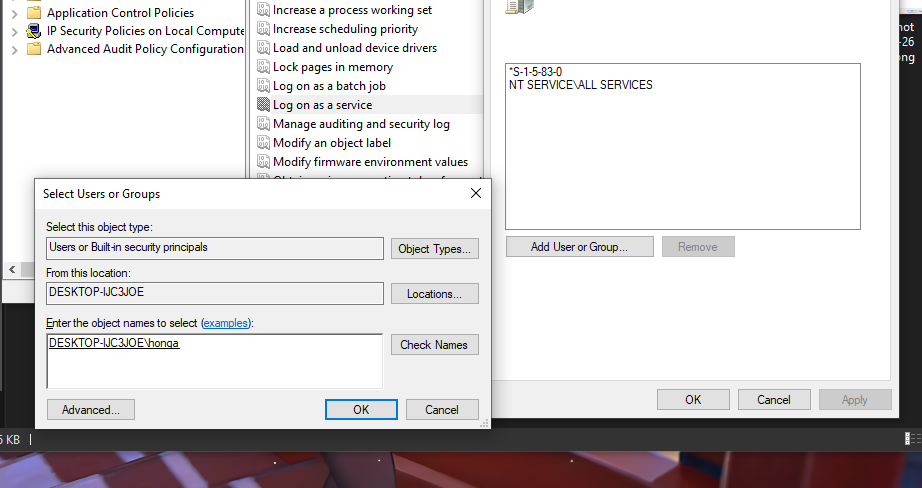
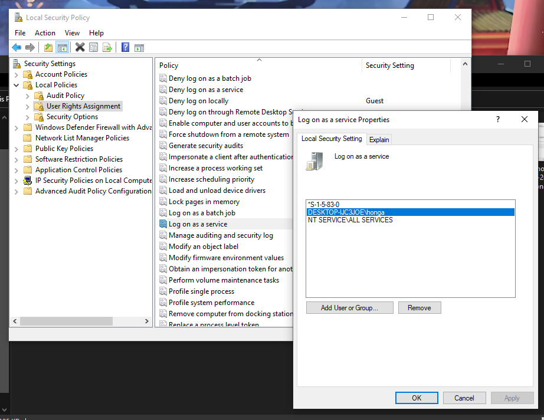
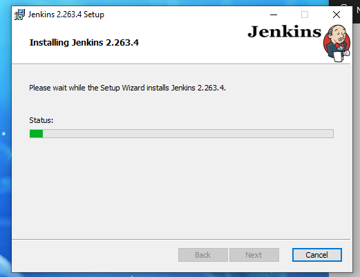
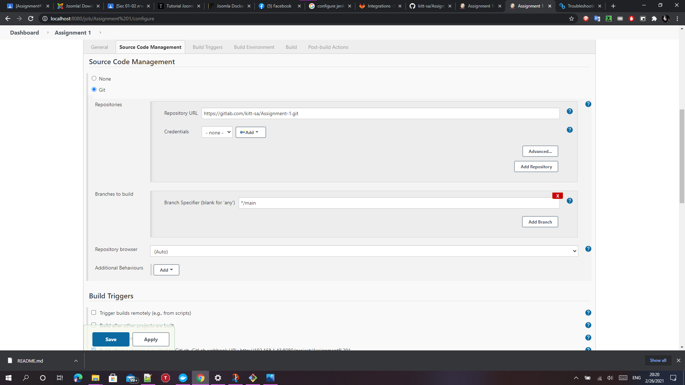

### How to install and config jenkins
#1.ติดตั้ง jenkines และ สามารถ Pull code จาก GitHub ได้
1.เมื่อเปิดตัวติดตั้งขึ้นมาให้กด Next

2.เลือกโฟเดอร์ที่ต้องการติดตั้ง แล้วกด OK

3.ใส่ user และ password ของเครื่อง แล้วกด Test Credentials

4.ไปที่ Local Security Policy ด้วยการ search "secpol"

5.เลือก User Rights Assignment -> คลิ๊กขวาเลือก Properties ที่ Log on as a service

6.เลือก Add User or Group... -> ในช่อง Enter the object names to select ให้ใส่ user ของเครื่อง -> เลือก Check Names -> เลือก OK

7.กด OK

8.กด Test Credentials หากถูกต้องจะขึ้นเครื่องหมายถูก แล้วกด Next

9.กด Test Port แล้วกด Next

10.เลือกโฟเดอร์ที่ติดตั้ง java jre ไว้ แล้วกด Next

11.กด Next

12.กด Install แล้ว รอจนกว่าจะติดตั้งเสร็จ

13.เมื่อกด Finish จะเปิด browser พร้อมแสดงหน้า Unlock Jenkins

14.ไปตาม path ที่แสดงไว้บนหน้าเว็บเพื่อคัดลอก password

15.วาง password แล้วกด Continue

16.เลือก install plugin แล้วรอจนเสร็จ

17.สร้าง Admin User แล้วกด Save and Continue

18.เมื่อเข้ามาจะมีหน้าตา

19.ไปที่ Manage Jenkins -> Configure System

20.เลื่อนหา Gitlab -> check Enable authentication for '/porject' end-point -> ตั้งชื่อ Connection -> ใส่ Gitlab URL -> ใน field Credentials เลือก Add "jenkins"

21.ใน field Kind ให้เปลี่ยนเป็น Gitlab API token -> Scope เปลี่ยนเป็น Global -> วาง token ที่ได้มาจาก Gitlab

22.เลือก Credentials ที่สร้างขึ้นมา แล้วกด Save

23.ไปที่ New Item -> ตั้งชื่อ Project แล้วเลือก Freestyle project

24.check Github project -> ในช่อง Project url ใส่ url ของ repository จาก gitlab -> ช่อง Display name ใส่ชื่อของ repository -> ช่อง gitlab connection เลือกชื่อ connection ที่สร้างไว้

25. ใน field Source Code Management เลือก Git ใส่ Repository URL -> เปลี่ยนชื่อ Branch

26.ใน field Build Triggers ให้ check "Build when a change is pushed to GitLab." -> check "Accepted Merge Request Events" -> check "Closed Merge Request Events"

27.ใน field Post-build Actions ให้เลือก Public build status to Gitlab แล้วกด Save

28.เลือก Build Now

29.เมื่อเข้ามาใน Workspace จะพบกับไฟล์ที่อยู่ใน Repository เดียวกันกับใน Github

#2.สามารถ Compile code ที่เขียนด้วยภาษาต่างๆ เช่น ภาษา Python
1.ติดตั้ง Plugin Python Plugin

2.ตั้ง directory

3.พิมคำสั่งเพื่อรัน ไฟล์ py

4.กด build now จะได้ผลลัพท์

#3.สามารถทำงานร่วมกับ Robotframework เพื่อทำการทดสอบระดับ UAT บน Web application ได้
1.ติดตั้ง Plugin Robotframework

2.ตั้ง directory ที่จะเก็บไฟล์ผลลัพท์ และ ตั้ง Thresholds -> กด Save

3.กด build now จะได้ผลลัพท์
